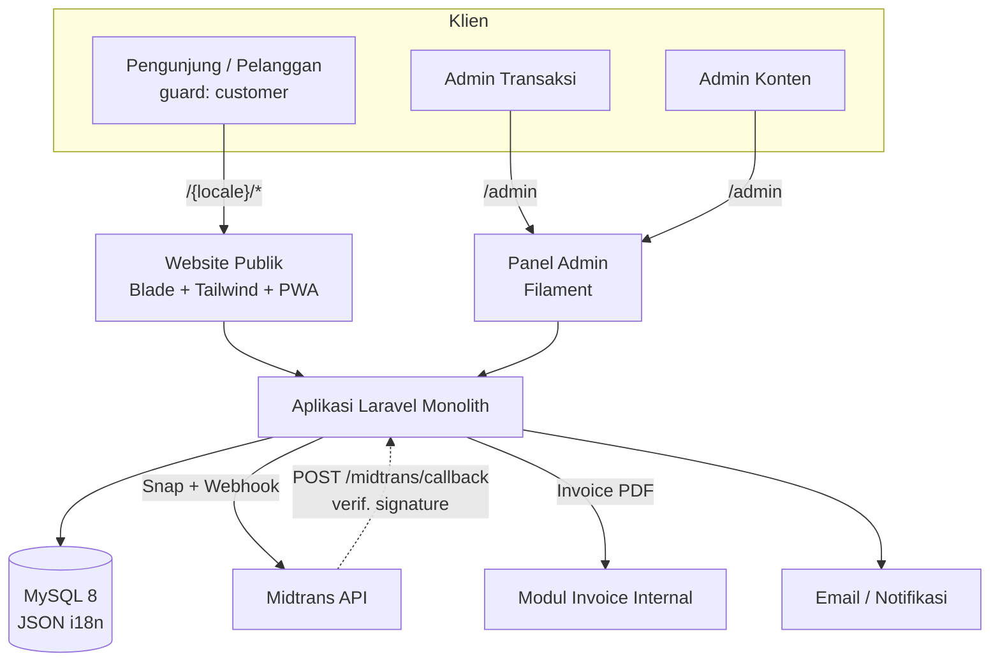
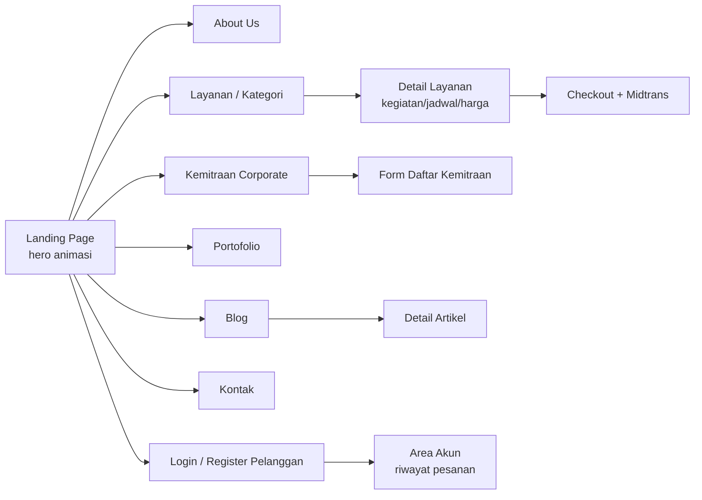
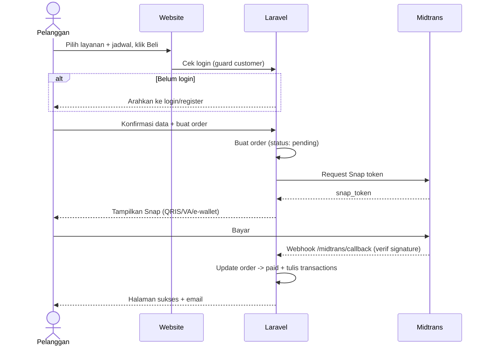
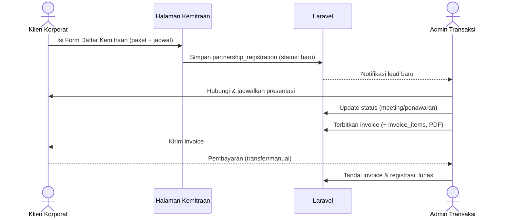
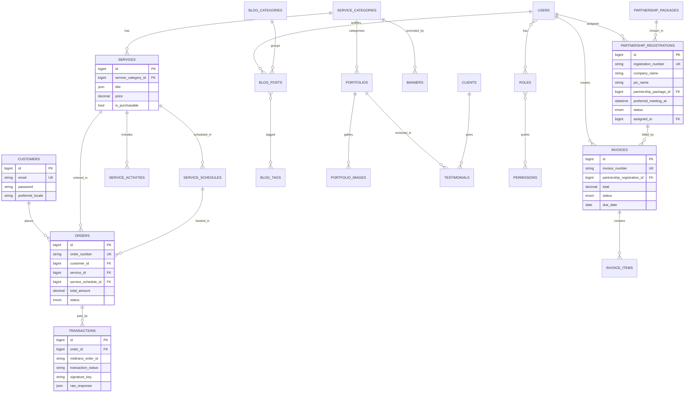

# PRD — Project Requirements Document
## Website Company Profile PT Delta Tiga Enam

| | |
|---|---|
| **Produk** | Website Company Profile + Admin Panel + Payment Gateway |
| **Klien** | PT Delta Tiga Enam |
| **Versi Dokumen** | 1.2 |
| **Tanggal** | 27 Juni 2026 |
| **Stack Utama** | Laravel 11 · Filament 3 · MySQL 8 · Midtrans |
| **Perubahan v1.1** | Multi-bahasa ID/EN · Responsif desktop & mobile + PWA · Login admin & pelanggan · Standar & keamanan upload media |
| **Perubahan v1.2** | Kemitraan jadi Program Corporate Training **by invoice** (terpisah dari Midtrans): halaman program, paket Blue/Silver/Gold/Platinum, form Daftar Kemitraan, dan modul invoice yang dikelola Admin Transaksi |

---

## 1. Overview

PT Delta Tiga Enam adalah lembaga pelatihan dan penyelenggara sertifikasi profesi yang membantu perusahaan dan individu meningkatkan kompetensi melalui pelatihan, konsultasi manajemen, pengelolaan human capital, dan layanan headhunter yang terintegrasi.

**Visi:** Menjadi mitra strategis dalam transformasi human capital berkelanjutan.

Proyek ini membangun website company profile sekaligus platform pemesanan layanan. Selain memperkenalkan profil dan layanan perusahaan, website memungkinkan pelanggan **mendaftar, login, lalu membeli layanan** secara online melalui payment gateway. Seluruh konten dikelola lewat panel admin tanpa menyentuh kode, dan website tampil **dwibahasa (Indonesia & Inggris)** serta **responsif penuh** di desktop maupun perangkat mobile.

### 1.1 Tujuan
- Menghadirkan citra profesional dengan desain informatif, minimalis, dan UI/UX modern.
- Menjadikan lini bisnis konsultan (kategori layanan) sebagai fitur unggulan yang terintegrasi penuh dengan pembayaran online.
- Memberi pemilik kontrol penuh atas konten dan terjemahannya tanpa intervensi developer.
- Menyediakan pengalaman setara di desktop dan mobile, dengan opsi pemasangan layaknya aplikasi (PWA).
- Memisahkan tanggung jawab admin: satu fokus transaksi, satu fokus konten; serta menyediakan akun pelanggan untuk bertransaksi.

### 1.2 Lingkup
Termasuk: landing page, about us, kategori & detail layanan, registrasi/login pelanggan, checkout + pembayaran Midtrans, riwayat pesanan pelanggan, **Program Kemitraan Corporate Training (by invoice, terpisah dari Midtrans)**, blog, portofolio, kontak, panel admin berbasis peran, dwibahasa ID/EN, dan PWA.
Tidak termasuk (fase ini): aplikasi mobile native (disiapkan jalur API/Sanctum bila dibutuhkan kelak), e-learning/LMS, bahasa di luar ID/EN.

### 1.3 Identitas Visual
- **Warna dominan:** putih, biru tua (navy), biru muda; **aksen:** gold (tipis, sentuhan premium).
- **Gaya:** minimalis, informatif, banyak ruang kosong, tipografi tegas dan terbaca.
- **Interaksi:** animasi dan transisi halus; hero section dengan background beranimasi dan slider rotasi kategori unggulan; tetap mulus di mobile.

---

## 2. Requirements

### 2.1 Functional Requirements

**Publik (pengunjung & pelanggan)**
- FR-01 Melihat landing page dengan hero beranimasi yang merotasi kategori layanan unggulan.
- FR-02 Melihat About Us (profil, visi, misi).
- FR-03 Menjelajah kategori & detail layanan (kegiatan, jadwal, harga).
- FR-04 **Mendaftar akun dan login sebagai pelanggan** untuk memesan layanan.
- FR-05 Memesan/membeli layanan dan membayar via Midtrans (QRIS, e-wallet, VA, kartu).
- FR-06 Melihat **riwayat pesanan & status pembayaran** di area akun pelanggan.
- FR-07 Menerima konfirmasi status pembayaran (halaman & email).
- FR-08 Melihat Kemitraan, Blog (+ detail), Portofolio (kegiatan, klien, testimoni), dan Kontak (form + 3 kantor).
- FR-09 **Mengganti bahasa antarmuka (ID/EN)** lewat language switcher; pilihan tersimpan.
- FR-10 Mengakses website secara responsif di desktop & mobile; dapat dipasang sebagai PWA.

**Admin**
- FR-11 Login aman ke panel admin (`/admin`) dengan guard terpisah dari pelanggan.
- FR-12 CRUD kategori layanan (tambah/kurang) **dengan field terjemahan ID & EN**.
- FR-13 CRUD layanan beserta kegiatan, jadwal, dan harga (dwibahasa).
- FR-14 CRUD banner (desktop & varian mobile) dengan penempatan dan masa tayang.
- FR-15 CRUD blog (artikel + banner + status, dwibahasa).
- FR-16 CRUD portofolio, galeri, klien, testimoni (dwibahasa pada teks).
- FR-17 CRUD mitra; CRUD kantor & pengaturan profil/About Us/visi/misi (dwibahasa).
- FR-18 Mengelola pesan kontak.
- FR-19 Melihat dashboard transaksi: daftar order, status, total pendapatan, grafik.
- FR-20 Manajemen pengguna admin & penetapan peran; manajemen akun pelanggan.
- FR-21 **Saat upload gambar/banner, sistem memvalidasi & mengoptimasi media** sesuai standar (lihat §3.10).
- FR-22 **Melihat & mengelola pendaftaran Kemitraan Corporate** (lead dari form Daftar Kemitraan) — ditangani Admin Transaksi.
- FR-23 **Menerbitkan & mengelola invoice kemitraan** (draft → terkirim → lunas), terpisah dari Midtrans, dengan ekspor PDF.
- FR-24 CRUD paket kemitraan (Blue/Silver/Gold/Platinum), manfaat, dan konten halaman kemitraan (Admin Konten).

**Publik — Program Kemitraan Corporate**
- FR-25 Melihat halaman Kemitraan: penjelasan program, Manfaat Program Kemitraan Corporate, dan Penawaran Paket (Blue/Silver/Gold/Platinum).
- FR-26 Mengisi form **Daftar Kemitraan** (informasi perusahaan, pilihan paket, penjadwalan presentasi/meeting, catatan) — **tanpa pembayaran online**; data terkirim ke admin untuk ditindaklanjuti via invoice.

### 2.2 Role & Hak Akses
Dua lapis autentikasi: **admin** (guard `web`, mengakses panel) dan **pelanggan** (guard `customer`, mengakses website & checkout). Akun pelanggan tidak punya akses apa pun ke panel admin.

| Aktor | Tanggung Jawab | Akses |
|---|---|---|
| **Super Admin** | Penanggung jawab sistem | Seluruh modul + manajemen user/role/pelanggan |
| **Admin Transaksi (Admin 1)** | Memantau arus pembayaran **dan mengelola kemitraan corporate by invoice** | Dashboard & data order/transaksi Midtrans (read), ekspor laporan; **kelola pendaftaran Kemitraan Corporate, jadwalkan meeting, terbitkan & kelola invoice (PDF)**. Tidak bisa ubah konten website |
| **Admin Konten (Admin 2)** | Mengelola seluruh konten | Kategori, layanan, jadwal, harga, banner, blog, portofolio, mitra, kontak, pengaturan (termasuk terjemahan). Tidak melihat detail transaksi |
| **Pelanggan (User)** | Membeli & memantau pesanannya | Registrasi/login, profil, checkout Midtrans, riwayat pesanan. Hanya data miliknya |

### 2.3 Non-Functional Requirements
- **Responsif:** mobile-first, breakpoint desktop/tablet/mobile; navigasi & tombol ramah sentuh; gambar `srcset`/lazy-load.
- **PWA:** installable (manifest + service worker), ikon aplikasi, shell offline dasar — memberi nuansa "mobile app" tanpa membangun native.
- **Performa:** target muat halaman publik < 3 detik; media dikompres & dikonversi WebP otomatis sesuai standar ukuran (§3.10).
- **Multi-bahasa:** seluruh teks UI & konten dinamis tersedia ID/EN; locale dari URL/preferensi user; fallback ke bahasa default.
- **Keamanan:** hashing password (bcrypt/argon2), guard terpisah admin & pelanggan, verifikasi email pelanggan, rate-limit login, proteksi CSRF, validasi & sanitasi input, verifikasi signature webhook Midtrans, opsi 2FA admin, HTTPS wajib, keamanan upload (§3.10).
- **SEO:** URL ramah (slug), meta dinamis per bahasa, tag `hreflang` ID/EN, sitemap.
- **Maintainability:** satu codebase monolith, konvensi konsisten, kode termodulasi.

---

## 3. Core Features

### 3.1 Manajemen Layanan & Pembayaran (Fitur Krusial)
Struktur berjenjang **Kategori → Layanan → Jadwal → Pembelian**. Kategori awal (dapat ditambah/dikurangi): Konsultasi Manajemen, Konsultasi Manajemen Human Capital, Headhunter, Pelatihan Karyawan, Sertifikasi Kompetensi. Tiap layanan punya rincian kegiatan, jadwal/batch (tanggal, kuota, mode offline/online/hybrid), dan harga (dasar + opsi override per jadwal). Tombol "Daftar/Beli" memicu checkout (mengharuskan login) → membuat order → Midtrans Snap → pembayaran → webhook memperbarui status otomatis.

### 3.2 Akun & Autentikasi Pelanggan (baru)
- Registrasi, verifikasi email, login, lupa password — terpisah dari admin (guard `customer`).
- Area akun: edit profil, bahasa pilihan, dan **riwayat pesanan beserta status pembayaran**.
- Checkout mensyaratkan akun agar transaksi tertaut ke pelanggan dan mudah ditelusuri.

### 3.3 Payment Gateway (Midtrans)
- Midtrans Snap untuk QRIS, e-wallet, virtual account bank, dan kartu.
- Webhook memverifikasi `signature_key`, lalu menyinkronkan status (`settlement`, `pending`, `expire`, `cancel`, `deny`) ke `orders` & `transactions` (idempoten).

### 3.4 Multi-Bahasa ID/EN (baru)
- Teks UI statis disimpan di lang files Laravel (`resources/lang/id`, `resources/lang/en`).
- Konten dinamis (kategori, layanan, blog, portofolio, dll.) disimpan sebagai kolom JSON terjemahan via spatie/laravel-translatable; admin mengisi versi ID & EN pada form yang sama.
- Language switcher di header; locale dipertahankan via URL prefix/preferensi & disimpan untuk pelanggan login.

### 3.5 Admin Panel (Filament)
- CRUD otomatis seluruh entitas konten dengan input dwibahasa.
- Dashboard ringkasan order, pendapatan, transaksi terbaru, grafik tren.
- Manajemen media dengan validasi & optimasi otomatis.

### 3.6 Blog
- Artikel dwibahasa dengan kategori, tag, gambar utama, banner header, status draft/publish, penjadwalan terbit.

### 3.7 Portofolio, Klien & Testimoni
- Portofolio kegiatan + galeri, daftar klien (logo), dan testimoni dengan rating.

### 3.8 Program Kemitraan Corporate Training (by invoice — baru)
Jalur B2B untuk kebutuhan klien **in-house corporate training**, **terpisah penuh dari payment gateway Midtrans** (penagihan manual via invoice). Isi halaman:
- **Tentang Kemitraan:** penjelasan spesifik program kemitraan PT Delta Tiga Enam.
- **Manfaat Program Kemitraan Corporate:** daftar manfaat (dikelola admin, bisa tambah/kurang).
- **Penawaran Paket:** kartu paket **Blue, Silver, Gold, Platinum** (deskripsi, fitur, harga indikatif/by quote).
- **Form Daftar Kemitraan:**
  - *A. Informasi Perusahaan* — Nama Perusahaan, Alamat Perusahaan, Nama PIC, Jabatan PIC, No.Telp/WhatsApp, Email.
  - *B. Pilihan Paket Kemitraan* — Blue / Silver / Gold / Platinum.
  - *C. Penjadwalan Presentasi/Meeting* — tanggal/waktu yang diinginkan (+ alternatif).
  - *D. Catatan Tambahan*.
  - Tombol **Kirim** → tidak ada pembayaran online; data menjadi *lead* yang dikirim ke **Admin Transaksi**.

**Alur penagihan invoice (di luar Midtrans):** lead masuk → Admin Transaksi menghubungi & menjadwalkan presentasi → kirim penawaran → **terbitkan invoice** (item, jumlah, pajak, jatuh tempo, PDF) → tandai **lunas** saat pembayaran diterima. Status pendaftaran & invoice dipantau di panel admin.

### 3.9 Kemitraan (logo), About Us & Kontak
- Logo mitra ("dipercaya oleh") untuk landing/halaman. About Us (profil, visi, misi dinamis). Kontak (form + 3 kantor dengan alamat, telepon/WA, peta).

### 3.10 Standar & Keamanan Upload Media (baru)
Saat admin menambah/mengubah gambar atau banner, sistem **memvalidasi dan mengoptimasi otomatis** agar website tetap cepat dan aman.

**Standar ukuran yang disarankan (divalidasi di sisi server):**

| Aset | Dimensi rekomendasi | Rasio | Maks ukuran | Format |
|---|---|---|---|---|
| Hero banner (desktop) | 1920 × 800 px | 12:5 | 500 KB | WebP/JPG |
| Hero banner (mobile) | 800 × 1000 px | 4:5 | 300 KB | WebP/JPG |
| Banner section | 1200 × 400 px | 3:1 | 300 KB | WebP/JPG |
| Thumbnail kategori | 800 × 600 px | 4:3 | 250 KB | WebP/JPG |
| Gambar layanan | 1200 × 800 px | 3:2 | 350 KB | WebP/JPG |
| Blog — gambar utama | 1200 × 630 px | 1.91:1 | 300 KB | WebP/JPG |
| Blog — banner header | 1600 × 500 px | 16:5 | 400 KB | WebP/JPG |
| Portofolio — cover/galeri | 1200 × 800 px | 3:2 | 350 KB | WebP/JPG |
| Logo mitra/klien | 400 × 200 px (transparan) | 2:1 | 100 KB | PNG/SVG |
| Foto testimoni/avatar | 200 × 200 px | 1:1 | 80 KB | WebP/JPG |
| Logo situs | 240 × 80 px | 3:1 | 100 KB | SVG/PNG |

**Mekanisme & keamanan:**
- Validasi server-side: whitelist tipe MIME & ekstensi, batas dimensi & ukuran sesuai tabel; tolak file lain.
- Optimasi otomatis: resize ke dimensi target, kompres, dan konversi ke WebP (Intervention Image / spatie image-optimizer); buat varian responsif untuk `srcset`.
- Nama file di-randomisasi/hash; metadata EXIF dihapus; SVG disanitasi (cegah skrip tertanam).
- File disimpan di direktori non-eksekusi (akses via storage symlink); eksekusi skrip di folder upload dinonaktifkan.
- Opsional: pemindaian antivirus (ClamAV) untuk berkas yang diunggah.

---

## 4. User Flow

### 4.1 Pembelian Layanan (dengan akun)
```
Landing Page -> Pilih Kategori -> Detail Layanan (kegiatan/jadwal/harga)
   -> Klik "Daftar/Beli" + pilih jadwal
       -> Belum login? -> Registrasi/Login pelanggan (verifikasi email)
           -> Konfirmasi data pemesan -> Buat Order (pending)
               -> Midtrans Snap (pilih metode bayar)
                   ├─ Berhasil  -> webhook (verifikasi signature) -> Order: paid -> halaman & email sukses
                   ├─ Pending   -> instruksi pembayaran (VA/QRIS)
                   └─ Gagal/Expire -> Order: failed/expired
   -> Riwayat pesanan tampil di area akun pelanggan
```

### 4.2 Ganti Bahasa & Eksplorasi
```
Header language switcher (ID/EN) -> seluruh UI & konten beralih bahasa
Navbar -> About Us | Layanan | Portofolio | Blog | Kemitraan | Kontak
Kontak -> isi form (locale tercatat) -> tersimpan -> notifikasi admin
```

### 4.3 Program Kemitraan Corporate (by invoice — baru)
```
Halaman Kemitraan -> baca penjelasan + Manfaat + Penawaran Paket (Blue/Silver/Gold/Platinum)
   -> Isi "Daftar Kemitraan" (A. Info Perusahaan, B. Paket, C. Jadwal Meeting, D. Catatan)
      -> Kirim (TANPA pembayaran online) -> lead tersimpan -> notifikasi ke Admin Transaksi
         -> Admin: hubungi -> jadwalkan presentasi -> kirim penawaran
            -> Terbitkan Invoice (PDF) -> kirim ke klien
               -> Pembayaran diterima (transfer/manual) -> tandai Invoice & pendaftaran "lunas"
```

### 4.4 Admin Konten (Admin 2)
```
Login /admin -> Kelola Kategori/Layanan/Jadwal/Harga (isi ID & EN)
            -> Kelola Banner (desktop+mobile)/Blog/Portofolio/Klien/Testimoni/Mitra
            -> Kelola Paket Kemitraan, Manfaat, & konten halaman Kemitraan
            -> Atur About Us/Visi/Misi/Kantor -> Baca pesan kontak
   (Upload gambar -> divalidasi & dioptimasi otomatis; menu transaksi & invoice tidak tampil)
```

### 4.5 Admin Transaksi (Admin 1)
```
Login /admin -> Dashboard Transaksi (pendapatan, grafik, order terbaru)
            -> Daftar Order & Transaksi Midtrans (filter status/tanggal) -> Detail -> Ekspor
            -> Pendaftaran Kemitraan (lead) -> proses status -> Kelola Invoice (terbitkan/PDF/lunas)
   (Menu konten tidak tampil)
```

---

## 5. Architecture

### 5.1 Pendekatan
Monolith Laravel: backend, website publik, dan panel admin dalam **satu project & satu database**, dengan **dua guard autentikasi** (admin & pelanggan) dan **middleware locale** untuk dwibahasa.
- `domain.com/{locale}/*` → halaman publik (Blade + frontend) sesuai bahasa.
- `domain.com/admin/*` → panel admin (Filament, guard `web`).
- `domain.com/api/*` → endpoint opsional (Sanctum) untuk PWA / mobile app native di masa depan.

**Dua jalur penagihan yang terpisah:**
1. **Online (Midtrans):** pembelian layanan reguler oleh pelanggan → `orders`/`transactions`.
2. **Invoice (manual):** Program Kemitraan Corporate Training → `partnership_registrations` → `invoices`/`invoice_items`, ditangani Admin Transaksi. Tidak menyentuh Midtrans.

### 5.2 Diagram Tingkat Tinggi
```
   Pengunjung/Pelanggan ─▶ Website Publik (Blade + PWA, responsif, i18n)
        (login customer)        │  guard: customer
   Admin 1 & 2 (/admin) ─▶ Panel Admin (Filament)
        (login web)             │  guard: web + RBAC (spatie)
                                ▼
                 ┌──────────────────────────────────┐
                 │   Aplikasi Laravel (Monolith)     │
                 │  Controllers · Models · Policies   │
                 │  Locale middleware · Translatable  │
                 │  Media pipeline (resize/optimize)  │
                 └───────┬───────────────────┬────────┘
                         │                   │
                 ┌───────▼──────┐     ┌──────▼─────────┐
                 │ MySQL (i18n) │     │  Midtrans API  │
                 └──────────────┘     │  + Webhook     │
                                      └──────┬─────────┘
                          /midtrans/callback (verifikasi signature) -> update DB
```

### 5.3 Komponen Utama
- **Dua guard auth:** `web` (admin) & `customer` (pelanggan), tabel terpisah `users` dan `customers`.
- **Locale middleware:** menentukan bahasa dari URL/preferensi; mengatur `app()->setLocale()`.
- **Translatable models:** kolom JSON menyimpan terjemahan ID/EN.
- **Media pipeline:** validasi → resize → kompres → WebP → varian responsif.
- **Payment service:** pembuatan order, Snap token, pemrosesan webhook (idempoten + verifikasi signature).
- **RBAC:** policy + spatie/permission untuk pemisahan Admin 1 & 2.

### 5.4 Integrasi Midtrans
Endpoint pembuatan transaksi memanggil Snap → menerima `snap_token`. Webhook `POST /midtrans/callback` memverifikasi `signature_key`, memperbarui `orders.status`, dan menulis `transactions` (cek status agar tidak diproses ganda).

### 5.5 Diagram Arsitektur (Mermaid)


### 5.6 Peta Halaman / Sitemap (Mermaid)


### 5.7 Alur Pembayaran Layanan — Midtrans (Mermaid)


### 5.8 Alur Kemitraan Corporate — by Invoice (Mermaid)



---

## 6. Database Schema

DDL lengkap ada di `database.sql`. Ringkasan entitas:

### 6.1 Daftar Tabel
| Domain | Tabel |
|---|---|
| Auth & Token | `users`, `customers`, `password_reset_tokens`, `personal_access_tokens`, `sessions` |
| Role & Permission | `roles`, `permissions`, `model_has_roles`, `model_has_permissions`, `role_has_permissions` |
| Profil & Pengaturan | `settings`, `company_missions`, `office_locations` |
| Layanan (inti) | `service_categories`, `services`, `service_activities`, `service_schedules` |
| Banner | `banners` |
| Kemitraan (logo) | `partners` |
| Kemitraan Corporate (by invoice) | `partnership_packages`, `partnership_benefits`, `partnership_registrations`, `invoices`, `invoice_items` |
| Blog | `blog_categories`, `blog_posts`, `blog_tags`, `blog_post_tag` |
| Portofolio | `portfolios`, `portfolio_images`, `clients`, `testimonials` |
| Pembayaran (Midtrans) | `orders`, `transactions` |
| Kontak | `contact_messages` |
| Sistem Laravel | `migrations`, `cache`, `cache_locks`, `jobs`, `job_batches`, `failed_jobs` |

### 6.2 Relasi Kunci
- `customers` 1—N `orders` 1—N `transactions`.
- `service_categories` 1—N `services` 1—N (`service_activities`, `service_schedules`).
- `services`/`service_schedules` 1—N `orders`.
- `partnership_packages` 1—N `partnership_registrations`; `partnership_registrations` N—1 `users` (admin penanggung jawab).
- `partnership_registrations` 1—N `invoices` 1—N `invoice_items`; `invoices` N—1 `users` (pembuat).
- `blog_categories` 1—N `blog_posts` N—N `blog_tags`; `blog_posts` N—1 `users` (penulis).
- `portfolios` 1—N `portfolio_images`; `portfolios`/`clients` 1—N `testimonials`.
- `banners` N—1 `service_categories`.
- `users` N—N `roles` N—N `permissions` (RBAC, khusus admin).

### 6.3 Catatan Desain
- **Dua jalur penagihan terpisah:** `orders`/`transactions` (Midtrans, online) vs `invoices`/`invoice_items` (kemitraan corporate, manual). Keduanya tidak saling bergantung.
- **Lead kemitraan:** `partnership_registrations` menampung form Daftar Kemitraan (info perusahaan, paket, jadwal meeting, catatan) dengan alur status `baru → … → lunas` dan `assigned_to` admin.
- **i18n:** kolom JSON berkomentar `i18n` menyimpan `{ "id": "...", "en": "..." }`; alamat kantor disimpan sebagai teks universal.
- **Auth ganda:** `users` (admin) & `customers` (pelanggan) terpisah; `password_reset_tokens` memakai kolom `guard`.
- **Keamanan transaksi:** `transactions.signature_key` & `raw_response` (JSON) untuk verifikasi dan audit.
- **Snapshot pesanan:** `orders` menyimpan `customer_id` sekaligus salinan data pemesan saat transaksi.
- Charset `utf8mb4`, InnoDB, foreign key eksplisit (`CASCADE`/`SET NULL`).
- Seed awal: 3 role, 5 kategori (ID/EN), 4 paket kemitraan (Blue/Silver/Gold/Platinum), 3 kantor, 3 misi, konfigurasi locale & kemitraan.

### 6.4 Entity Relationship Diagram (Mermaid)


---

## 7. Tech Stack

### 7.1 Inti
| Lapisan | Teknologi | Alasan |
|---|---|---|
| Bahasa/Framework | PHP 8.2+ · Laravel 11 | Ekosistem matang, komunitas besar di Indonesia |
| Admin Panel | Filament 3 (+ plugin Translatable) | CRUD otomatis + input dwibahasa |
| Database | MySQL 8 | Stabil, mendukung kolom JSON untuk i18n |
| Auth admin & RBAC | Laravel Auth · spatie/laravel-permission | Pemisahan Admin Transaksi & Admin Konten |
| Auth pelanggan | Guard `customer` (Laravel Fortify/breeze-like) | Login & registrasi user yang bertransaksi |
| Multi-bahasa | spatie/laravel-translatable · Laravel localization | Konten & UI ID/EN |
| Payment (online) | Midtrans Snap (SDK Laravel) | QRIS, e-wallet, VA, kartu untuk pasar Indonesia |
| Penagihan kemitraan | Modul invoice internal + barryvdh/laravel-dompdf | Invoice corporate by invoice (PDF), terpisah dari Midtrans |

### 7.2 Frontend & Mobile
| Kebutuhan | Teknologi |
|---|---|
| Template publik | Blade + Tailwind CSS (mobile-first, responsif) |
| Interaktivitas | Alpine.js / Livewire |
| Animasi & transisi | CSS animations, AOS, atau GSAP (hero & scroll reveal) |
| Slider hero | Swiper.js |
| App-like di mobile | PWA (manifest + service worker, mis. vite-plugin-pwa) |
| API (opsional, untuk app native nanti) | Laravel Sanctum |

### 7.3 Media & Keamanan
| Kebutuhan | Teknologi |
|---|---|
| Optimasi/resize gambar | Intervention Image · spatie/image-optimizer |
| Manajemen media | Laravel Storage (public/cloud), opsional spatie/media-library |
| Sanitasi SVG / keamanan upload | SVG sanitizer, validasi MIME, hash filename, strip EXIF |
| Keamanan aplikasi | CSRF, rate limiting, verifikasi email, opsi 2FA admin, verifikasi signature Midtrans |
| Editor konten | Rich text editor bawaan Filament (per bahasa) |
| SEO | Sitemap, meta dinamis per locale, `hreflang` |

### 7.4 Infrastruktur & Operasional
| Kebutuhan | Pilihan |
|---|---|
| Hosting | VPS (Ubuntu) atau hosting yang mendukung PHP 8.2 |
| Web server | Nginx / Apache (HTTPS wajib) |
| Domain & SSL | deltatigaenam.com + sertifikat HTTPS |
| Version control | Git (GitHub/GitLab) |
| Backup | Backup database & media terjadwal |

---

## 8. Implementation Guide (untuk Claude Code)

Bagian ini adalah instruksi build agar backend & frontend berjalan baik. `database.sql` adalah sumber kebenaran skema; buat migration Laravel yang **identik** dengannya (nama tabel, kolom, tipe, FK).

### 8.1 Prasyarat
PHP 8.2+, Composer 2, Node.js 20+ & npm, MySQL 8 (atau MariaDB 10.6+), Git. Ekstensi PHP: `pdo_mysql`, `mbstring`, `gd`/`imagick`, `intl`, `zip`, `bcmath`, `fileinfo`, `openssl`.

### 8.2 Dependencies
**Composer:**
```
laravel/framework:^11
filament/filament:^3
filament/spatie-laravel-translatable-plugin:^3
spatie/laravel-permission:^6
spatie/laravel-translatable:^6
laravel/sanctum:^4
midtrans/midtrans-php:^2
intervention/image:^3
spatie/laravel-image-optimizer:^1
barryvdh/laravel-dompdf:^3
mcamara/laravel-localization:^2
```
**npm:** `tailwindcss`, `@tailwindcss/typography`, `alpinejs`, `swiper`, `aos` (atau `gsap`), `vite-plugin-pwa`.

### 8.3 Langkah Inisialisasi
```bash
composer create-project laravel/laravel deltatigaenam
cd deltatigaenam
composer require filament/filament spatie/laravel-permission spatie/laravel-translatable \
  laravel/sanctum midtrans/midtrans-php intervention/image \
  spatie/laravel-image-optimizer barryvdh/laravel-dompdf mcamara/laravel-localization \
  filament/spatie-laravel-translatable-plugin
php artisan filament:install --panels
php artisan vendor:publish --provider="Spatie\Permission\PermissionServiceProvider"
npm install && npm install -D tailwindcss @tailwindcss/typography alpinejs swiper aos vite-plugin-pwa
# Buat migration sesuai database.sql, lalu:
php artisan migrate
php artisan db:seed
php artisan storage:link
npm run build   # atau: npm run dev
```

### 8.4 Struktur Folder (ringkas)
```
app/
├── Models/            # Eloquent: User, Customer, ServiceCategory, Service, ServiceSchedule,
│                      #   ServiceActivity, Banner, Partner, PartnershipPackage, PartnershipBenefit,
│                      #   PartnershipRegistration, Invoice, InvoiceItem, BlogCategory, BlogPost,
│                      #   BlogTag, Portfolio, PortfolioImage, Client, Testimonial, Order,
│                      #   Transaction, OfficeLocation, CompanyMission, ContactMessage, Setting
├── Filament/
│   ├── Resources/     # 1 Resource per entitas konten + Order/Transaction + Partnership/Invoice
│   ├── Pages/         # Dashboard transaksi, Settings page
│   └── Widgets/       # Stat pendapatan, grafik, transaksi terbaru
├── Http/
│   ├── Controllers/   # Halaman publik + CheckoutController + MidtransWebhookController
│   └── Middleware/     # SetLocale
├── Services/          # MidtransService, InvoiceService, MediaService
└── Policies/          # Per-model, dipetakan ke role
resources/
├── views/             # Blade publik (layouts, home, services, partnership, blog, dst.)
├── lang/{id,en}/      # String UI statis
└── js|css/            # Alpine, Swiper, AOS/GSAP, Tailwind
routes/
├── web.php   api.php  # web (publik+webhook), api (Sanctum, opsional)
database/
├── migrations/  seeders/  factories/
```

### 8.5 Konfigurasi `.env`
```
APP_URL=https://www.deltatigaenam.com
APP_LOCALE=id
APP_FALLBACK_LOCALE=id
DB_CONNECTION=mysql
DB_DATABASE=deltatigaenam
DB_USERNAME=   DB_PASSWORD=
MIDTRANS_SERVER_KEY=
MIDTRANS_CLIENT_KEY=
MIDTRANS_IS_PRODUCTION=false
MIDTRANS_IS_SANITIZED=true
MIDTRANS_IS_3DS=true
MAIL_MAILER=smtp   # untuk verifikasi email & notifikasi
FILESYSTEM_DISK=public
```

### 8.6 Autentikasi & Guard
- Guard `web` → model `User` (admin, akses panel Filament `/admin`).
- Guard `customer` → model `Customer` (akses website & checkout). Daftarkan di `config/auth.php` (`guards.customer`, `providers.customers`).
- RBAC admin via spatie: role `super_admin`, `admin_transaksi`, `admin_konten`. Terapkan `Filament::auth()` + `canAccessPanel()` hanya untuk `User`.
- Sanctum melindungi `routes/api.php` (opsional, untuk PWA/app native).

### 8.7 Peta Model & Relasi (kunci)
| Model | Relasi | Translatable (JSON) |
|---|---|---|
| ServiceCategory | hasMany Service, Banner, Portfolio | name, short_description, description, meta_* |
| Service | belongsTo ServiceCategory; hasMany ServiceActivity, ServiceSchedule, Order | title, short_description, description, price_label, duration |
| Order | belongsTo Customer, Service, ServiceSchedule; hasMany Transaction | — |
| Transaction | belongsTo Order | — |
| PartnershipRegistration | belongsTo PartnershipPackage, User(assigned_to); hasMany Invoice | — |
| Invoice | belongsTo PartnershipRegistration, User(created_by); hasMany InvoiceItem | — |
| BlogPost | belongsTo BlogCategory, User(author); belongsToMany BlogTag | title, excerpt, content, meta_* |
| Portfolio | belongsTo ServiceCategory; hasMany PortfolioImage, Testimonial | title, short_description, content |

Gunakan trait `HasTranslations` (spatie) + properti `$translatable` pada model yang punya kolom JSON i18n.

### 8.8 Peta Route
| Metode | Path | Tujuan |
|---|---|---|
| GET | `/{locale}/` | Landing page |
| GET | `/{locale}/about` | About Us |
| GET | `/{locale}/layanan` & `/{locale}/layanan/{slug}` | Daftar & detail layanan |
| POST | `/{locale}/checkout` | Buat order (butuh auth customer) |
| GET | `/{locale}/kemitraan` | Halaman program kemitraan |
| POST | `/{locale}/kemitraan/daftar` | Submit form Daftar Kemitraan |
| GET | `/{locale}/portofolio` `/blog` `/blog/{slug}` `/kontak` | Halaman konten |
| POST | `/{locale}/kontak` | Submit form kontak |
| GET/POST | `/{locale}/login` `/register` `/password/*` | Auth pelanggan |
| GET | `/{locale}/akun/pesanan` | Riwayat pesanan pelanggan |
| POST | `/midtrans/callback` | Webhook Midtrans (tanpa locale, kecualikan CSRF) |
| * | `/admin/*` | Panel Filament |

### 8.9 Filament Resources & Visibilitas per Role
| Resource / Page | super_admin | admin_konten | admin_transaksi |
|---|---|---|---|
| ServiceCategory, Service, Schedule, Activity | ✓ | ✓ | — |
| Banner, Blog*, Portfolio, Client, Testimonial, Partner | ✓ | ✓ | — |
| PartnershipPackage, PartnershipBenefit, Settings, OfficeLocation, CompanyMission | ✓ | ✓ | — |
| ContactMessage | ✓ | ✓ | — |
| Order, Transaction (read), Dashboard Transaksi & Widget | ✓ | — | ✓ |
| PartnershipRegistration, Invoice, InvoiceItem | ✓ | — | ✓ |
| User & Role management | ✓ | — | — |

Terapkan via Policy + `Resource::canViewAny()`/`shouldRegisterNavigation()` berbasis `auth()->user()->hasRole(...)`.

### 8.10 Integrasi Midtrans (langkah)
1. `MidtransService::createSnapToken(Order $order)` → kirim `transaction_details`, `item_details`, `customer_details`.
2. Frontend memuat Snap.js dengan `MIDTRANS_CLIENT_KEY`, buka popup.
3. `MidtransWebhookController` memverifikasi `signature_key` = `sha512(order_id + status_code + gross_amount + server_key)`; map `transaction_status` → `orders.status` (`settlement/capture→paid`, `pending→pending`, `expire→expired`, `cancel/deny→cancelled/failed`); tulis/`updateOrCreate` `transactions`; idempoten.
4. Kirim email konfirmasi pada status `paid`.

### 8.11 Modul Invoice Kemitraan (di luar Midtrans)
- Submit form → `PartnershipRegistration` (status `baru`) + notifikasi Admin Transaksi.
- Admin membuat `Invoice` (+ `InvoiceItem`), `InvoiceService` menghitung subtotal/pajak/total, generate PDF via dompdf ke `storage` (`file_path`).
- Update status invoice (`draft→terkirim→lunas`) dan sinkronkan status registrasi.

### 8.12 Media & i18n
- `MediaService`: validasi MIME/dimensi/ukuran (tabel §3.10), resize + konversi WebP (Intervention) + optimasi (spatie), nama file hash, strip EXIF, sanitasi SVG. Hasilkan varian responsif untuk `srcset`.
- i18n: middleware `SetLocale` dari prefix URL; `mcamara/laravel-localization` untuk route lokal & `hreflang`; switcher di header; field Filament memakai plugin Translatable (tab ID/EN).

### 8.13 Frontend
- Tailwind dengan token warna brand: `navy` (#0A2A5E contoh), `blue` muda, `white`, aksen `gold`. Tetapkan di `tailwind.config`.
- Hero: Swiper untuk rotasi kategori unggulan + background beranimasi (CSS/GSAP). Scroll reveal via AOS/GSAP.
- Mobile-first, uji breakpoint sm/md/lg; gambar `loading="lazy"` + `srcset`.
- PWA: `vite-plugin-pwa` (manifest, ikon, service worker, offline shell).

### 8.14 Seeders
`DatabaseSeeder` memanggil: RoleSeeder (3 role + permission), AdminUserSeeder (1 super_admin awal — minta kredensial via `.env`), ServiceCategorySeeder (5 kategori ID/EN), PartnershipPackageSeeder (Blue/Silver/Gold/Platinum), OfficeLocationSeeder (3 kantor), CompanyMissionSeeder (3 misi), SettingSeeder (locale + company profile + partnership). Nilai awal sudah tersedia di blok seed `database.sql`.

### 8.15 Definition of Done (checklist verifikasi)
- [ ] `php artisan migrate:fresh --seed` sukses; skema cocok dengan `database.sql`.
- [ ] Login admin (`/admin`) jalan; menu sesuai role (Admin 1 lihat transaksi/invoice, Admin 2 lihat konten).
- [ ] Pelanggan bisa register, verifikasi email, login, dan melihat riwayat pesanan.
- [ ] Alur beli layanan → Snap → webhook → order `paid` berfungsi (mode sandbox Midtrans).
- [ ] Form Daftar Kemitraan tersimpan sebagai lead; admin bisa terbitkan invoice + unduh PDF.
- [ ] Pergantian bahasa ID/EN mengubah seluruh UI & konten; `hreflang` muncul.
- [ ] Upload banner/gambar tervalidasi ukuran, dikompres & jadi WebP otomatis.
- [ ] Responsif rapi di desktop & mobile; hero beranimasi; PWA installable.
- [ ] Lighthouse: Performance & SEO ≥ 90 pada halaman utama.

---

- **Website:** www.deltatigaenam.com · **Email:** info@deltatigaenam.com · **LinkedIn:** linkedin.com/company/deltatigaenam
- **Kantor Pusat:** Gedung Bursa Efek Indonesia Tower 1 Level 3, Unit 304, Jl. Jend. Sudirman Kav. 52-53, SCBD Senayan, Kebayoran Baru, Jakarta Selatan — Telp. 021-5890 5002 / 0818 834 766
- **Kantor Pemasaran:** Cikarang Technopark, Jl. Inti I Blok C1 No. 7, Cibatu, Cikarang Selatan, Kab. Bekasi, Jawa Barat 17530 — Telp. 021-8988 1110
- **Kantor Operasional:** Taman Widya Asri Blok GG No. 18, Serang, Kota Serang, Banten 46111 — Telp. 0817 018 6104
